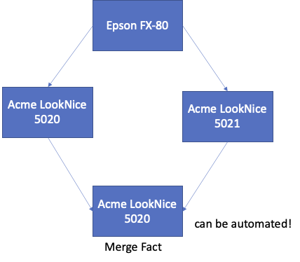
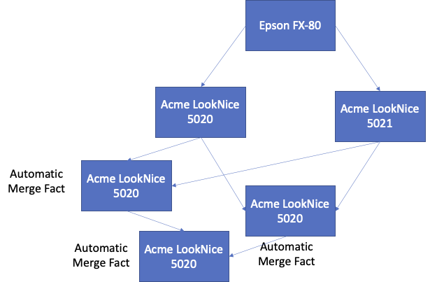

# Event Sourcing without Responsibility

This is a tale about our experience implementing event sourcing
without even knowing it existed.  We're a small software consultancy
specializing in project work involving in functional programming.  It
was 2015, and one of our clients was (still is, actually) a large
auto-shop chain.

They called us because of a shift in their IT strategy: The shops they
run are divided into multiple lanes, each for servicing one car at a
time.  At the end of each lane is a metal davenport desk with various
pieces of hardware - a printer, diagnostic equipment, etc.  Before
2015, the davenport contained a stationary PC.  The client was
preparing to get rid of those PCs, and instead issue a portable device
(essentially a rugged tablet) to each employee.

Now here's a problem: When an employee (and their device) moved to a
different lane (or a different shop), they needed to re-configure it
to connect to the devices at the local davenport.  This was a tedious
process, involving manually entering MAC addresses printed in
9-point-type on the back of the devices etc.  So the client asked us
to develop a piece of software that would automate this process, with
the following requirements:

- Each piece of equipment should only be configured once; its
  configuration should then automatically be available on all devices.
  
- The software should function in an environment with an unreliable
  wireless network of limited capacity.
  
- The organization had no way to operate a central server.
  
These requirements meant the devices needed to store configuration
data locally to ensure availability, and communicate configuration
changes between themselves.  Early on, we realized that we could not
use the usual persistence approach of storing the current
configuration state in a database.  Consistency is hard enough in an
always-on environment, but with devices weaving in and out of
networks, it was clear this would be unmanageable.

Embarrassingly, we had never heard of event sourcing: At the time, the
functional-programming and event-sourcing communities had few points
of contact.  Consequently, we developed local persistence and
synchronization from first principles.

## Facts about State

Our thinking revolved around the idea of a *fact*, i.e. something
that's true.  Now, "Davenport 123 is attached to an Acme PrintAce at
IP x" is not a fact: It's only true for a certain period in time, and
might no longer be true now.  However, "Annette Mueller stated on Dec
6, 2021 that Davenport 123 is attached to an Acme PrintAce at IP x" -
that's a fact we can store, if we're there to witness it.

Witnessed facts are purely accumulative, and this greatly simplifies
synchronization and consistency: When two devices meet, they need only
exchange those facts the the respectively opposite device does not
know about yet.

Now, facts like these don't exist in isolation.  If "Hans Mayer stated
on Dec 6, 2021 that Davenport 123 is attached to a Highres WriteQueen
at IP y", that fact is related to the previous one.  Both facts take
the form of attributed statements about the current state of the
configuration at Davenport 123.  They could be related in the
following ways:

- One fact "supersedes" the other.
- The two facts are in conflict with each other.

How can the system distinguish between the two?  Well, if one
statement was made in a situation where the existence of the other is
known, than the second supersedes the first, as it implies a causal
relationship.  If not, i.e. if both statements were made independently
of one another, there's a conflict.

## Conflict Obsession

When we started designing the system, we were obsessed with conflicts.
We made two assumptions:

- Conflicts would be rare, as we assumed that users would stand
  physically close to equipment as they were making configuration
  changes.
- For a two-way conflict, there's a right way and a wrong way to
  resolve it - we'd need to make sure the system picks the right way.
  
Both assumptions turned out to be wrong, and we did not notice this
until the system went operational.

But let's rewind a little bit: The system represents a piece of
configuration state by a value of type `OptionalVal<'a>` as follows
(this is F# code from the actual system):

```fsharp
type OptionalVal<'a> =
| Absent
| Good of option<'a>
| Conflict of Set<WithMeta<option<'a>>>

type Meta = { user: string
			  machine: string
			  datetime: DateTime.T }

type WithMetha<'a> = WithMeta of 'a * Meta
```

In the first release, whenever the system encountered a `Conflict`
value, it would seek to resolve it and make a choice between the
contained values.  As we were obsessed with getting the choice right,
the system presented the user with the different choices in the UI,
along with metadata that might help a human resolve it.  With the
answer in hand, the system would create a "merge fact" that supersedes
the two facts in conflict like so:



We were young and naive: We didn't take into account the unreasonable
effectiveness of the synchronization algorithm, which would propagate
the two conflicting facts to many devices before anyone got a chance
to resolve the conflict.  This was a UI fail - users didn't know why
they were presented with this choice and had trouble figuring out who
should press what button.

We quickly moved to automate the creation of a "merge fact",
preferring more recent facts over older ones, for example.
Unfortunately, this almost ended in disaster, as this happened on all
devices that had the conflicting facts, and that turned out to be quite
a few.  They'd create multiple merge facts, which also had to be
merged, kicking off an endless cascade of merges:



Fortunately, we noticed before the accumulation got completely out of
hand and pulled the release.  We made two changes:

- no more automatic merge facts
- in the face of a `Conflict` value, the system would pick one of the
  values *deterministically*
  
We fully expected users to complain when the system would pick the
wrong value, but this never happened.  A user would simply change the
configuration, adding a merge fact manually.

Looking at the data, we were surprised how often conflicts happened,
despite our assumption about physical proximity.  Even though we never
really figured out why these conflicts were so frequent, we should not
have been surprised: In presenting a manual merge UI, we were assuming
that there is only a single system, when it fact a distributed system
was at work.

## Fact Persistence

As there was only weak connectivity between the devices and unreliable
network connectivity, we had to store facts locally.  We settled on
using SQLite, known for its simplicity, scalability and reliability.
(Even had we known about event databases, these would have seemed like
overkill.)  Here is our database schema:

```sql
CREATE TABLE hashes (
  key_hash BLOB NOT NULL,
  obsoleted_hash BLOB NOT NULL,
  FOREIGN KEY(key_hash) REFERENCES kv(hash)
);
CREATE INDEX hashesIdx1 ON hashes(obsoleted_hash);
CREATE TABLE kv (
  hash BLOB PRIMARY KEY NOT NULL UNIQUE, -- hash bytes
  guid BLOB NOT NULL, -- guid bytes
  property STRING NOT NULL, -- property name
  value BLOB NOT NULL, -- property value
  meta STRING NOT NULL -- meta JSON
);
CREATE INDEX kvIdx1 ON kv(guid,property);
```

Each fact is identified b a hash and a guid identifying the entity
affected, and makes a statement about a property having a certain
value.  Each hash can also be associated with the hashes of other
facts obsoleted by this one.  We then used a view to make all
obsoleted facts invisible:

```sql
CREATE VIEW kvCurrent AS
SELECT hash,guid,property,value,meta FROM kv
WHERE kv.hash NOT IN 
  (SELECT obsoleted_hash FROM hashes)
```

We then made another mistake: As gathering the facts associated with a
given shop locality did not seem obviously efficient to us, we assumed
it would be inefficient.  Consequently, we also added a table with a
*locality map* storing the current state associated with a given
locality.  (What folks over here would probably call a projection or a
query model - we were not aware of that terminology.)

Alas, the locality map continually got out of sync for reasons we
never fully understood.  (The code was quite complex, as it had to
react to synchronization.)  Out of sheer laziness to find all the
bugs, we pulled the locality map and just collected the relevant facts
each time.  This turned out to be quite sufficiently efficient in
practice.

Today, the software only ever accesses facts, and makes do without any
projections.  This is made possible through the use of a database that
can handle indexing, as opposed to a classic event store that mostly
stores an append log.

## Going Back in Time

Using a proper database also had another pleasant side effect: Some
users asked to "turn back time" when they'd made a configuration
mistake.  We implemented this by collecting all the facts associated
with a given locality, and displaying a list of them in chronological
order.  The user can then select a point in time in the past.  The
system now can simply collect all the facts up that point associated
with the locality and use it to create a virtual database.

We had used a monad to implement dependency injection for the
database.  Originally, this was for testing without on-disk storage.
Here, we were able to re-use this functionality to create a temporary
implementation of the database interface that has access to only the
subset of facts up to that point in time.  From that, the system can
reconstruct the state at that point in time using existing code, and
generate new facts on top of the current state that will re-recreate
the state from the past.

Consequently, the design of our "facts database" had conveniently
provided all the pieces needed to implement this completely new
time machine.

## Syncing Up

One crucial aspect of the "facts database" design was that it enabled
efficient synchronization across devices.  A variety of events trigger
such a synchronization: A configuration change, or the arrival of a
device in a WiFi network.  When that happens, the device in questions
broadcasts a UDP packet asking for a synchronization partner.

Once it finds one, the system assembles all the facts into a [Merkle
tree](https://en.wikipedia.org/wiki/Merkle_tree) on each device.  The
devices then cooperate to traverse the Merkle tree downwards in a
breadth-first fashion.  A Merkle tree has at each node a hash code
that identifies all the data in its subtree.  At each level, both
sides determine the hashes that match between the devices, removing
them from the traversal.  At the bottom is the list of facts that
needs to be transferred to the other side.

The top hash is included in the UDP broadcast that triggers
synchronization: Any device receiving it can compare it with its own
top hash.  If they match, no synchronization is necessary.

## Wrapping Up

It should be easy to see this system fundamentally as an
event-sourcing system.  Just substitute "event" for "fact", and the
techniques and technologies from event sourcing apply.

However, note that the system contains no "query models". These turned
out to be unnecessary to answer the questions that the system has.
This is a way of thinking we've found to be more useful than to start
from a CQRS mindset: Think about the questions you want answered, and
what of data structure of system might answer them sufficiently well.
We've found this less confusing than the murky concept of
"responsiblity".  In our case, just adding some indexing to our "fact
store" enabled answering those questions directly from the facts.

We hope this post has given you some ideas for your own next project!

# Dr. Michael Sperber

Michael Sperber is CEO of Active Group in Tübingen, Germany.  Mike
specializes in functional programming, and has been an internationally
recognized expert in the field: He has spoken at the top conferences
in programming languages, authored many papers on the subject as well
as several books.  Moreover, he is an expert on teaching programming.
